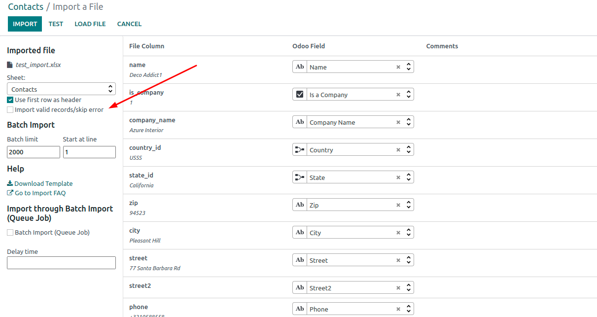
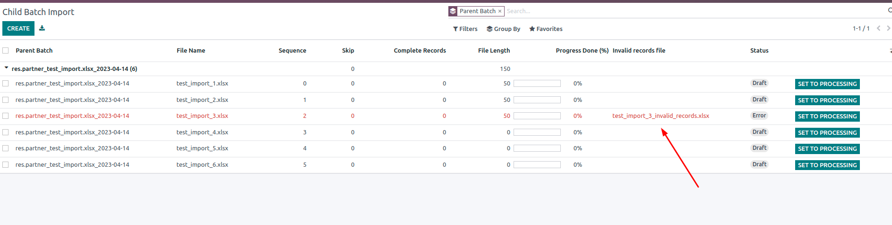
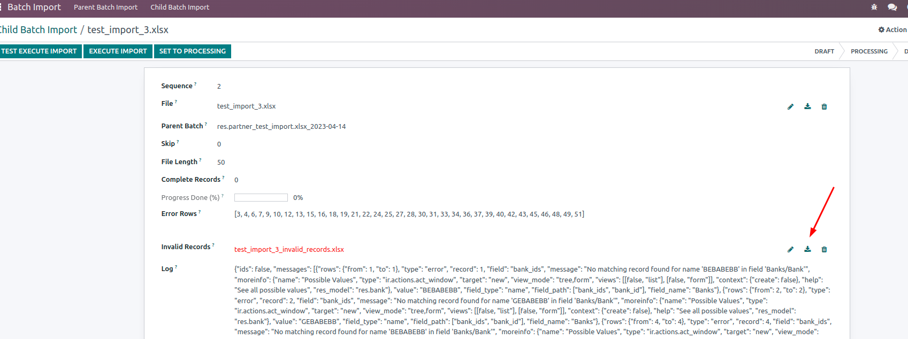
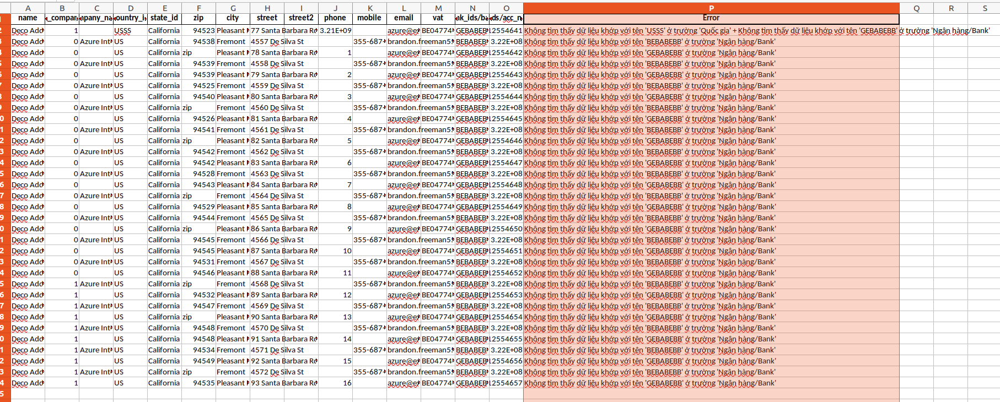

Guidelines : https://www.loom.com/share/26277a12c70142b4bc1cf46121e7295e

Update: Force import valid records, and skip invalid records

download file log invalid records

-----------------------------------

Note : Odoo only reads up to 1 million records per import file, so if you have an import file with more than 1 million records, you should split it into smaller files before importing it into Odoo