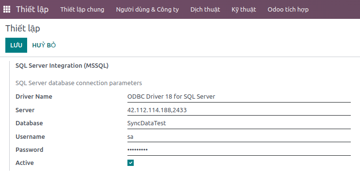

# Prerequisites

1. [Install MSSQL driver and python DB connector](https://learn.microsoft.com/en-us/sql/connect/python/pyodbc/python-sql-driver-pyodbc?view=sql-server-ver16)
    1. [Install the Microsoft ODBC driver for SQL Server (Linux)](https://learn.microsoft.com/en-us/sql/connect/odbc/linux-mac/installing-the-microsoft-odbc-driver-for-sql-server?view=sql-server-ver16&tabs=alpine18-install%2Calpine17-install%2Cdebian8-install%2Credhat7-13-install%2Crhel7-offline)
    2. [Install pyodbc](https://github.com/mkleehammer/pyodbc)
   ```shell
      source venv/bin/active
      pip install pyodbc 
   ```

2. Config SQL Server params in Odoo: *Settings/ Odoo tích hợp/ Bravo/ Cấu hình đồng bộ* <br/><br/>


3. (Optional): install mssql-cli (an interactive command line query tool for SQL Server)

```shell
   source ven/bin/active
   pip install mssql-cli
```s


4. (Optional): install mssql server by docker
    1. [MSSQL docker image](https://hub.docker.com/_/microsoft-mssql-server)
    2. Run mssql server
   ```shell
      docker run -e "ACCEPT_EULA=Y" -e "MSSQL_SA_PASSWORD=admin123@()[]"  -p 1433:1433 -d --restart unless-stopped mcr.microsoft.com/mssql/server:2019-latest
   ```


# Connect to DB

# Help

1. If you can't start mssql server, check logs for more information

```shell
docker logs -f <CONTAINER_NAME>
```

+ set a stronger password if you got below error

```shell
ERROR: Unable to set system administrator password: Password validation failed. The password does not meet SQL Server password policy requirements because it is too short. The password must be at least 8 characters..
```

2. MSSQL Server query limitation
   1. [Parameter per stored procedure - 2100 parameters](https://learn.microsoft.com/en-us/sql/sql-server/maximum-capacity-specifications-for-sql-server?redirectedfrom=MSDN&view=sql-server-ver16)
   2. [Insert row number - maximum 1000 rows](https://learn.microsoft.com/en-us/sql/t-sql/queries/table-value-constructor-transact-sql?redirectedfrom=MSDN&view=sql-server-ver15#limitations-and-restrictions)
3. Display utf-8 content in DB
   1. [Set collation for column in DB](https://learn.microsoft.com/en-us/sql/relational-databases/collations/set-or-change-the-column-collation?view=sql-server-ver16)

4. SQL server datetime
   1. select available timezone in SQL server
   ```sql
      SELECT * FROM sys.time_zone_info;
   ```
   2. default datetime value in UTC timezone
   ```sql
      insert into B20Warehouse (PushDate) values(GETUTCDATE())
   ```
   3. default datetime value in specific timezone
   ```sql
       insert into B20Warehouse (PushDate) values(SYSDATETIMEOFFSET() AT TIME ZONE 'SE Asia Standard Time')
   ```
   
   
5. Can't install pyodbc <br/><br/>
_ERROR_

```
ImportError: libodbc.so.2: cannot open shared object file: No such file or directory
```

_SOLUTION_
```shell
sudo apt install unixodbc-dev -y
sudo apt-get update
```