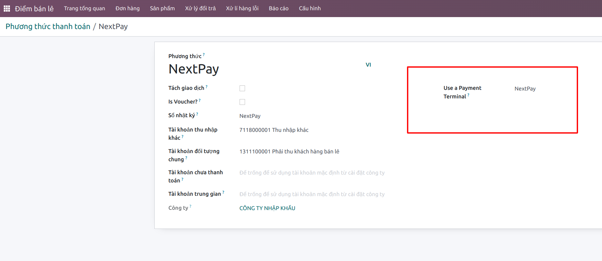
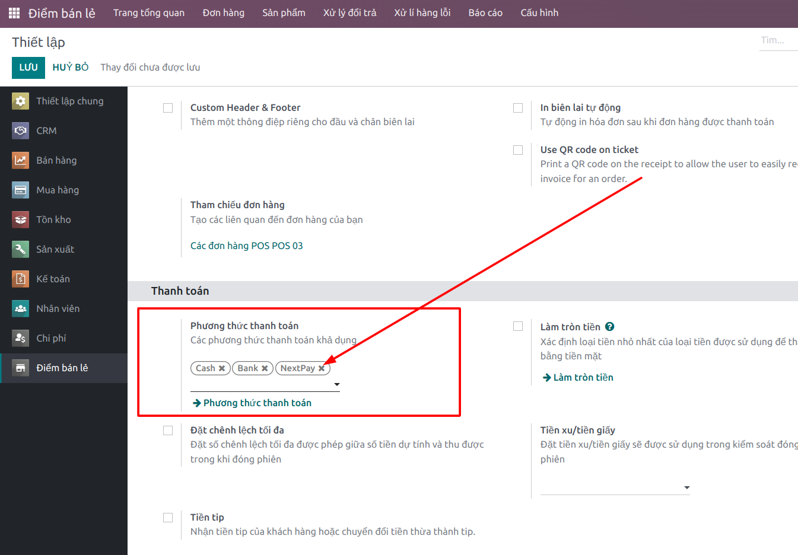
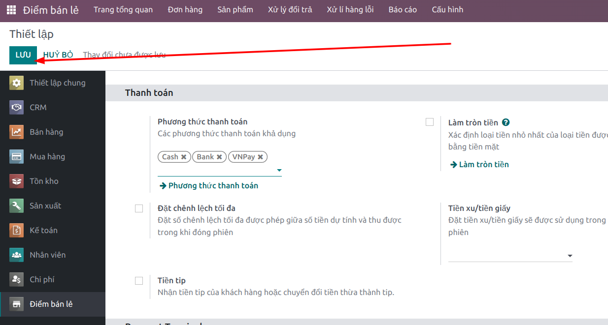
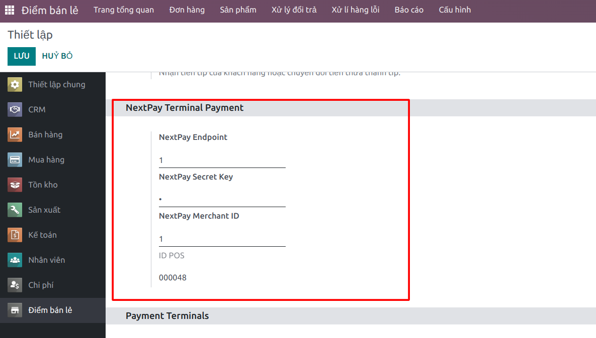

# Instruction

1. Create a POS payment method named NextPay on Odoo 

 

2. Add NextPay to pos.config accordingly  

 

3. Click Save

 

4. Scroll down to section *NextPay Terminal Payment* and update NextPay params 

 

5. Click Save

 