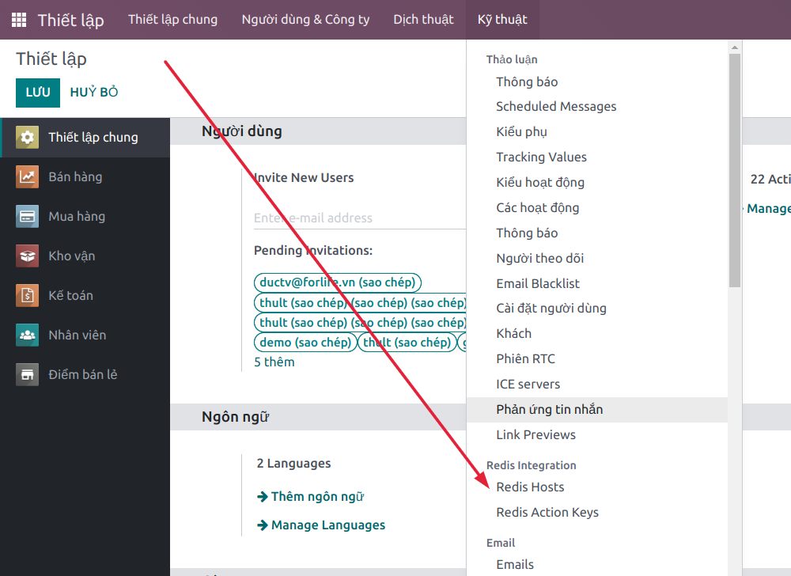
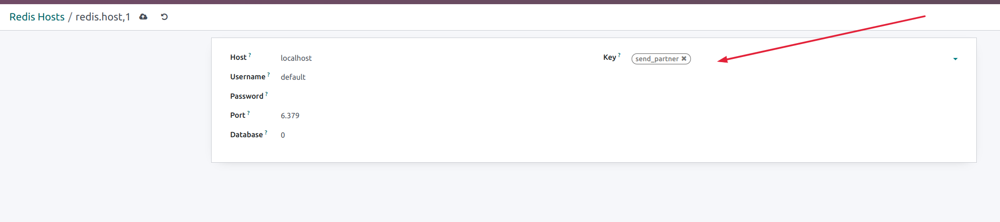
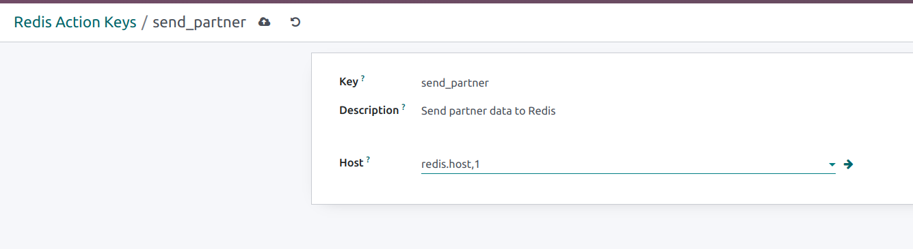

# How to use in real example

1. Define keys data in xml, example in file [/example/redis_action_key_data.xml](example/redis_action_key_data.xml)

2. Inherit model 'redis.action', line _**#9**_ in file [/example/res_partner.py](example/res_partner.py)

3. **After finished coding, restart server**

4. Create Redis host
   

5. Attach created keys to appropriate host

+ On Redis Host form
  
  ****************
+ OR  
  ****************
+ On Redis Action Key form
  