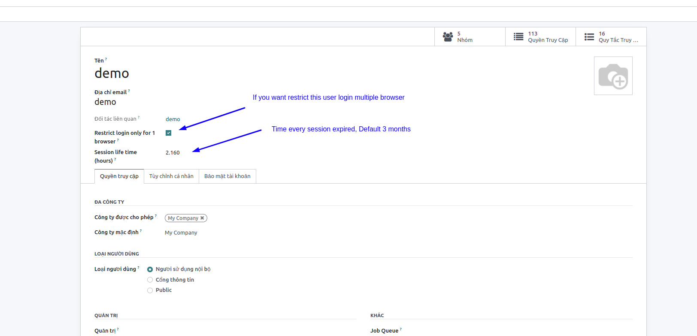
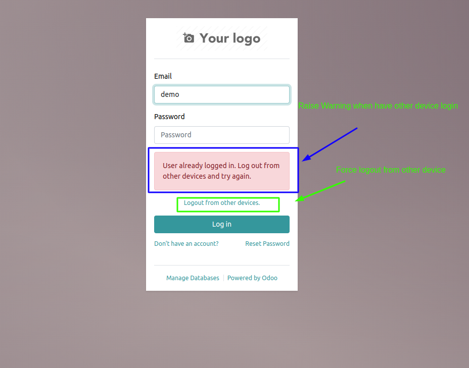

This module restricts the concurrent sessions for users.The user will get restricted from login if they already login in to another device.Also it provides an option to force logout for users

solution: https://drive.google.com/file/d/19buyum7K6rhyFWCnKFWyeEjY6Qi9vJLQ/view?usp=sharing

guidelines: https://vimeo.com/822488384

1: when create user:

2: when user login on other device
