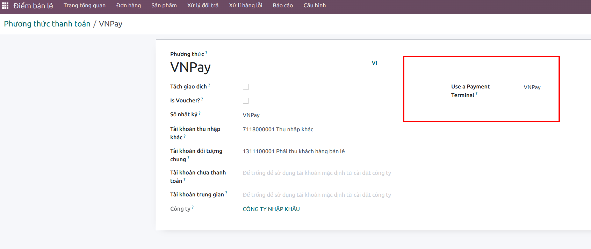
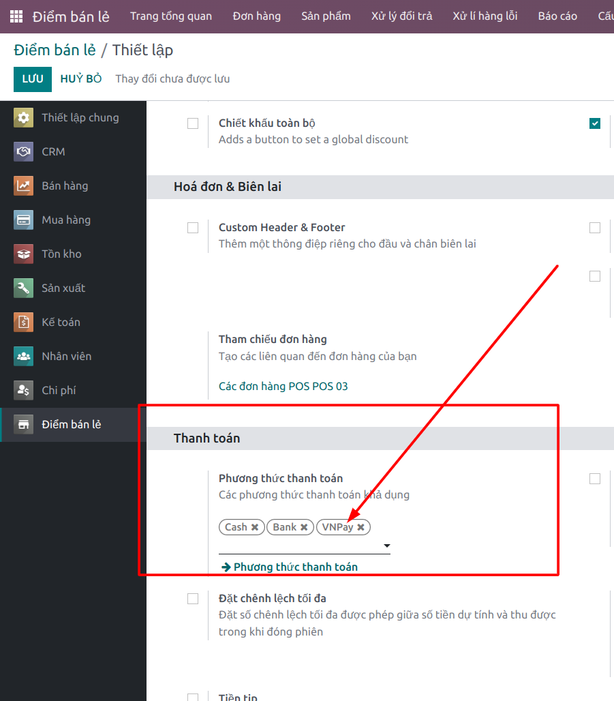
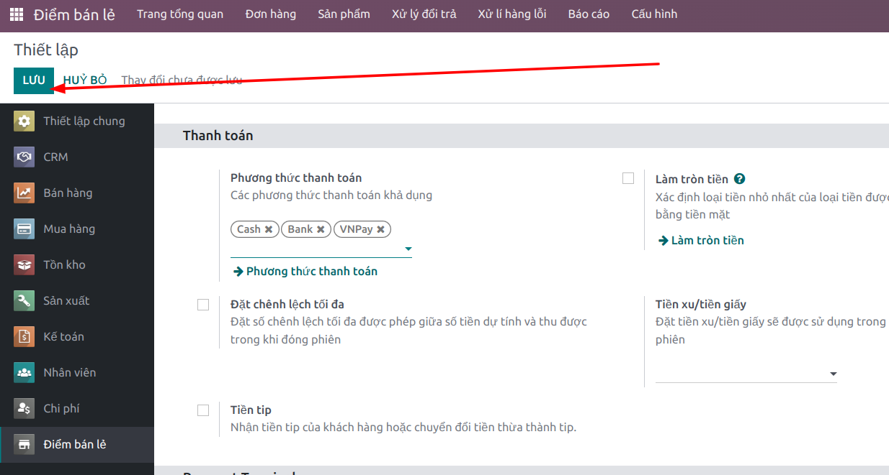
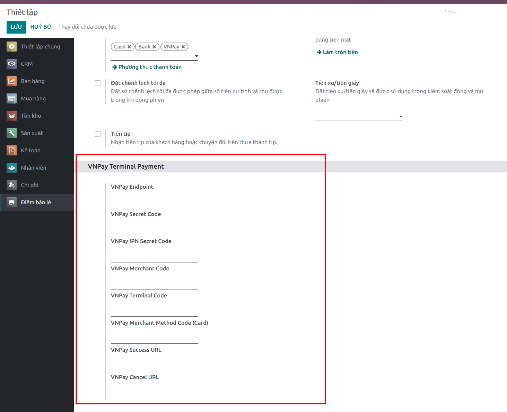

# Instruction

1. Create a POS payment method named VNPay on Odoo 

 

2. Add VNPay to pos.config accordingly  

 

3. Click Save

 

4. Scroll down to section *VNPay Terminal Payment* and update VNPay params 

 

5. Click Save

 